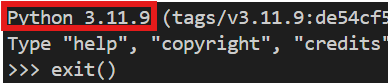

# MANUEL UTILISATEUR SensiAna -- V1.0.0
Le but de ce document est d'aider à l'utilisation du logiciel d'étude de sensibilité. Pour lire correctement ce fichier, ouvrez-le dans VisualStudio Code et appuyez sur `Ctrl+Maj+V`.

> **N.B.** -- Lancer le logiciel avec un thème système clair. 

Vous avez un modèle compliqué ? Avec beaucoup de paramètres ? Et vous voulez comprendre l'influence des paramètres sur le résultat du modèle ? La visualiser ? Et la caractériser ? La quantifier ?

Ce logiciel est fait pour vous ! Il réalise un étude de sensibilité en créant des jeux de paramètres sur ceux que vous voulez étudier.

## Préparation de l'environnement
Pour utiliser le code et minimiser les erreurs. L'installation de *Python* est laissée à l'utilisateur (3.11 ou 3.13 clé en main).
### Environnement virtuel
Pour bien travailler et ne pas mélanger les librairies de vos différents projets *Python*.
Dans le dossier du code (celui qui contient le fichier) créez un environnement virtuel *Python* :
```bash
python -m venv myEnv 
```
La variable `python` est le chemin vers la version de *Python* que vous allez utiliser. Si la variable système est définie, ce sera sans doute `python`.
La variable `myEnv` est le nom que vous souhaitez donner à votre environnement virtuel. Par exemple, si c'est un projet de tuyauterie, vous pourriez l'appeler `sensiTuyauterie`.
# Activation de l'environnement virtuel
Tapez dans le terminal :
```bash
.\myEnv\Scripts\activate
```

## Installation des librairies *Python* nécessaires
Pour faire fonctionner le logiciel.
### Version de *Python*
Au cas où vous ne la connaissez pas tapez `python` dans le terminal ou le chemin vers votre *Python*. La première ligne affiche la version de *Python*. Pour en sortir tappez `exit()`.



### Installation

Installer les librairies :
 - SALib ;
 - scikit-learn ;
 - scipy ;
 - PySide6 ;
 - plotly ;
 - kaleido.

Si vous n'avez pas Internet, pas d'souss ! Vous avez tout dans py_libs :
Si votre version de *Python* est 3.11, tapez dans le terminal
```bash
pip install -r .\py_libs\311\req_py311.txt
```
Tout s'installe. Coool.
Si votre version de *Python* est 3.13, tapez dans le terminal
```bash
pip install -r .\py_libs\313\req_py313.txt
```
Si vous avez une autre version débrouillez-vous.

## Lancement du logiciel
Pour lancer le logiciel.
### Inclure votre simu dans le code
Pour se faire, créez une fonction *Python*, disons `myFunc`, dans un fichier disons `myFile.py`.
Cette fonction :
 - Lance une simulation unique (logiciel ou calcul *Python*) pour un jeu de paramètres donc renseigne les paramètres au logiciel pour le calcul ;
 - A pour argument le jeu de paramètres à renseigner pour lancer une simulation ;
 - Renvoie une valeur.

> ATTENTION : L'ordre des arguments de la fonction doit être le même que celui des nom d'axes, bornes d'axes et nombre de pas par axe renseignés dans le fichier `data.toml`.

Mettez ce fichier à la racine. Ouvrez le fichier `theFunc.py` et écrivez-y dans l'en-tête `from myFile.py import myFunc`.

À la place du `return` de la fonction `theFunction`, écrivez-y par exemple dans le cas de trois arguments dans votre fonction `myFunc` :
```python
return myFunc(arg[0], arg[1], arg[2])
```

### Paramétrer le logiciel
Pour calibrer le logiciel au problème que vous souhaitez étudier.
#### [Optionnel] Lire un *toml*
Afin d'avoir la coloration syntaxique des fichiers *toml*, dans *VSCode* tapez `Ctrl+Schift+X`, et installez la bibliothèque Even Better TOML. Si vous n'avez pas internet, cliquez plutôt sur les `...` au -dessus de la petite éprouvette puis cliquez sur `Install from VSIX` et choisissez `tamasfe.even-better-toml-0.21.2.vsix` à la racine du projet.

#### Remplir data.toml

Ce fichier configure l'application de visualisation et d'analyse de sensibilité. Il est organisé en plusieurs sections : graph, valeurs critiques, analyse de sensibilité, et sauvegarde.

---

##### Graph part

Paramètres liés à la construction de la grille d’évaluation et à la visualisation.

```toml
title = "test"
axis_name = ["coord x", "coord y", "coordzz", "test", "Jolie typographie"]
axis_borders = [[-1,2], [0,5], [0,1.5], [0,2]]
axis_step = [40,30,60, 40] # limited to 10**6 at total
```

- **`title`** : Titre de la visualisation.
- **`axis_name`** : Liste des noms pour chaque axe.
- **`axis_borders`** : Bornes min/max pour chaque axe, sous forme `[min, max]`.
- **`axis_step`** : Nombre de points par axe. Le produit de tous les pas ne doit pas dépasser `10⁶` (sinon, la visualisation sera trop lourde).

---

##### Critical value part

Paramètres pour identifier les zones "critiques" de la fonction.

```toml
critical_value = [0.8]
criterium = "over"
```

- **`critical_value`** : Valeur seuil utilisée pour détecter les zones critiques.
  - Une valeur -> avec `over` ou `under`
  - Deux valeurs -> avec `in` ou `out`
- **`criterium`** : Mode de détection :
  - `"over"` : zones où la valeur est supérieure au seuil
  - `"under"` : zones où la valeur est inférieure au seuil
  - `"in"` : zones où la valeur est entre deux seuils (`[val1, val2]`)
  - `"out"` : zones où la valeur est en dehors de ces deux seuils

---

##### Sensitivity analysis part

Paramètres du calcul d’analyse de sensibilité (PCA, Sobol, etc.).

```toml
high_precision_analysis = 1
n_sample = 0
```

- **`high_precision_analysis`** : Active (1) ou désactive (0) le recalcul précis des points pour l’analyse Sobol.
- **`n_sample`** : Nombre d’échantillons pour Sobol.
  - Si `0`, utilise la valeur par défaut (`1024`)
  - Recommandé : une puissance de 2 (512, 1024, 2048…)

---

##### Backup part

Paramètre de sauvegarde automatique.

```toml
backup = ""
```

- **`backup`** : Chemin ou nom de fichier pour sauvegarder les résultats (optionnel). Laisser vide pour désactiver. Si vous choisissez ce mode, un fichier `backup_data.toml` sera générer avec les paramètres issus du fichier de backup. Pour en générer un, cliquez sur le bouton idoine dans l'interface.

### Lancer le logiciel
Tapez
```bash
python .\main.py
```

> **N.B.** -- Au lancement du logiciel, un `FutureWarning` s'écrit dans le terminal, il est normal et n'est pas de notre ressort.

### Charger une backup
Afin d'ouvrir le logiciel à partir de données déjà calculées, dans le `data.toml` renseignez dans la variable `backup` le chemin au fichier de la sauvegarde (`BackUpFile.txt`) et lancez le logiciel. Voilà.

Une jolie barre de progression montre son avancement.

## Utiliser le logiciel
C'est pour utiliser le logiciel.

### Visualisation
Affiche par défaut un graph 3D de la valeur cible en fonction des deux premiers paramètres. Les autres paramètres sont modifiables via les slider sur le côté gauche du logiciel. Pour tracer la valeur cible en fonction d'un autre paramètre que celui déjà utilisé, choisissez-le dans le menu déroulant en haut de la fenêtre puis cliquez sur `Valider`.

#### Contrôles
Sur le graph :
 - Glisser avec clique gauche enfoncé : Pivote le graphe ;
 - Glisser avec le clique molette enfoncé : Zoom ;
 - Glisser avec le clique droit enfoncé : Translate ;
 - Scroll molette : Zoom.

#### Export de l'image
Vous pouvez exporter l'image actuelle en statique en appuyant sur le bouton idoine. Trois formats de fichier vous sont proposés :
 - *JPEG* et *PNG* : image statique : la vue enregistrée est la même que celle affichée (même zoom, centrée pareillement, ...) ;
 - *HTML* : image dynamique : vous pouvez interagir avec la vue affichée (zoom, translation, rotation, ...) mais les valeurs dans les sliders restent les même.
Dans les deux cas, un fichier *.txt* avec les paramètres des slider est aussi créé.

#### Favoris
Vous pouvez mettre des jeux de paramètres en favoris. Double-cliquer dessus vous restore la vue avec la valeurs des paramètres du favoris. CLique droit pour renommer le favoris ou lui donner une couleur. Vous pouvez le faire glisser pour modifier son ordre. Si vous avez plusieurs fenêtre ouverte, ouvrir puis fermer les favoris les mets à jours (supprimer un même favoris sur deux fenêtres sans mettre à jour le favoris le supprimera de la première fenêtre mais ne fera rien sur la seconde, fermez puis ré-ouvrez le panneau des favoris pour les mettre à jour).

Exporter une backup export aussi les favoris avec leur couleur et leur position dans l'ordre des favoris.

### Analyse statistique
Vous fournis de VRAIS arguments à donner au destinataire des calculs.
#### Introduction à l'analyse de sensibilité

Quand on modélise un système physique (thermique, mécanique, électrique, etc.), on manipule souvent une **fonction de plusieurs paramètres** (température, pression, longueur, vitesse, etc.).  
L’**analyse de sensibilité** cherche à répondre à une question simple :

> **Quels sont les paramètres qui influencent le plus le résultat ?**

On utilise pour cela plusieurs outils, chacun avec sa manière de mesurer l’importance d’un paramètre. Voici les trois principaux utilisés dans le logiciel :

---

#### Analyse en Composantes Principales (PCA)

La **PCA** (ou **ACP** en français) est une méthode mathématique qui permet de :
 - **réduire le nombre de dimensions** du problème,
 - **détecter les directions principales** dans lesquelles la fonction varie le plus.
Variance du nuage de point des paramètres.

##### En résumé :
> La PCA dit : "Voici les combinaisons de paramètres qui expliquent le plus de variations dans le système."

##### Exemple :
Si un système dépend de 5 paramètres, mais que 90 % de la variation de sortie est expliquée par une combinaison linéaire de 2 d’entre eux, la PCA va te le montrer.

---

#### Indices de Sobol (1er ordre et totaux)

Les **indices de Sobol** mesurent la **part de la variance du résultat** qui est due à **chaque paramètre**, soit **pris seul** (1er ordre), soit **en interaction avec les autres** (total).

---

##### En résumé
> L’indice de Sobol d’un paramètre te dit :  
> _“Si je fais varier ce paramètre, quelle proportion du comportement du système cela explique ?”_

##### 1er ordre (`S1`)

Mesure **l’effet du paramètre seul**, sans interaction avec les autres.

- Un **indice proche de 1** -> le paramètre **a une forte influence seul** ;
- Un **indice proche de 0** -> il **n’explique pas grand-chose tout seul**, mais peut agir en interaction.

**Exemple :**  
Un indice de 1er ordre de `0.6` pour la **température** signifie que **60 % de la variabilité** du résultat est due à la température seule. Plus la somme des indices de Sobol du premier ordre est proche de *1*, plus le système est entièrement expliqué par les variables seules et de fait moins les interactions entre variables sont importantes.

##### Total (`ST`)

Mesure **l’effet global du paramètre**, **incluant toutes ses interactions** avec les autres.

- Si `ST` est **élevé** mais `S1` **faible** -> le paramètre **agit en interaction** ;
- Si `ST ≈ S1` -> il **agit principalement seul**.

**Exemple :**  
Un indice total de `0.9` pour la **pression** signifie que la pression explique **90 % de la variabilité** du système, seule **et en interaction avec les autres paramètres**.

##### À retenir

- Les indices vont de **0 à 1** ;
- Plus un indice est élevé, plus le paramètre est **influant** ;
- Comparer `S1` et `ST` permet de **distinguer les effets directs et combinés**.

##### Simplification des calculs
Les indices de Sobol ont besoin de recalculer d'évaluer le modèle sur des points précis le plus souvent différents de ceux choisis par l'utilisateur. De fait, quand chaque appel au modèle est trop long, on peut dans `data.toml` fixer `high_precision_analysis` à `0`. Cela va interpoler les points de calcul des indices de Sobol par rapport aux points déjà connus (noeuds), ce qui évite tout appel au modèle supplémentaire et réduit ainsi grandement les temps de calculs. Seulement, il faut pour que l'approximation fonctionne être dans l'hypothèse des petites variations sur une maille (variation linéaire du modèle entre deux noeuds consécutifs). Vous pourrez donc trouver à côté de chaque les indices de Sobol l'erreur faite sur l'hypothèse d'approximation pour chaque dimension/paramètre de l'étude de sensibilité. En dessous vous aurez l'erreur moyenne (toute dimension confondue). Vous pourriez vouloir être sous 10%, 5% voir même 1% en fonction de votre modèle et du raffinement de l'étude de sensibilité (nombre de pas par paramètres).

---

#### Corrélation de Spearman

La **corrélation de Spearman** mesure **le lien entre chaque paramètre et la sortie**, en tenant compte **de l’ordre** (croissance ou décroissance), pas forcément du lien linéaire.

##### En résumé :
> Spearman répond à :  
> "**Quand le paramètre augmente, est-ce que la sortie a tendance à augmenter ou diminuer ?**"

 - Corrélation proche de **+1** = plus le paramètre augmente, plus la sortie augmente ;
 - Corrélation proche de **-1** = plus le paramètre augmente, plus la sortie diminue ;
 - Corrélation proche de **0** = peu ou pas de lien DIRECT.

##### Exemple :
Une corrélation de Spearman de `-0.9` pour la pression signifie que plus la pression augmente, plus la sortie du système diminue.

---

#### Clustering des nœuds critiques

Le **clustering** regroupe les nœuds critiques en **familles de comportements similaires**.  
Il permet de **segmenter l’espace des paramètres** en zones homogènes pour mieux comprendre les mécanismes en jeu.

##### En résumé
> Le clustering répond à la question :  
> _“Existe-t-il des groupes de paramètres qui produisent des comportements similaires ?”_

##### Objectifs

- **Détecter des structures cachées** dans les points critiques ;
- **Comparer les profils moyens** entre groupes (via radar plots) ;
- **Analyser les causes dominantes** dans chaque groupe (via la variance des paramètres).

##### Méthodes possibles

- K-means, Agglomerative, DBSCAN, etc.
- Le nombre de clusters peut être fixé ou estimé automatiquement.

##### À retenir

- Très utile **après une réduction de dimension** (ex. PCA) ;
- Permet de **comprendre la diversité des cas critiques** ;
- Complémentaire des indices de sensibilité, car il identifie des **familles de solutions**, pas seulement des variables importantes.

### Quoi choisir ?

| Méthode         | Idéal pour…                                                  | Remarques                                         |
|------------------|--------------------------------------------------------------|---------------------------------------------------|
| **PCA**          | Réduire la complexité globale                                | Donne une vue d'ensemble                         |
| **Sobol (1er)**  | Identifier les paramètres les plus influents individuellement | Requiert plus de calculs ou interpolation        |
| **Sobol (Total)**| Détecter les interactions entre paramètres                   | Utile quand les effets combinés sont importants  |
| **Spearman**     | Vérifier les tendances monotones                             | Rapide à calculer                                |
| **Clustering**   | Regrouper les comportements similaires dans l’espace critique | Aide à explorer les **mécanismes dominants** dans chaque zone |

---

#### Répartition des noeuds critiques par paramètres
Pour chaque paramètre : Outil alternatif calculant pour chaque valeur de ce paramètre le nombre de valeurs critiques (pour toutes les autres valeurs des autres paramètres), calcul ensuite le minimum, le maximum, la médiane, la moyenne et la variance de ces valeurs critiques. Permet de savoir quels paramètres produisent le plus de valeurs critiques.

#### Conclusion

Ces outils sont complémentaires. Utilisés ensemble, ils permettent de comprendre en profondeur **comment un système réagit aux changements de ses paramètres**, et donc de prendre de **meilleures décisions d’optimisation, de conception ou de simplification.**

## Dev à venir
Vous pouvez voir ici les dev à venir, si un vous interesse particulièrement, n'hésitez pas à me le faire savoir, ça pourra me motiver à le faire en priorité :)

### Court terme
  - Dans les boîtes déployables de l'onglet d'analyse : quand replié affiche le tooltip et supprime les tooltip car apparaissent tout le temps c'est relou ;
  - Réorganisation de l'ordre de présentation des widget de l'onglet d'analyse ;
  - Fichier backup en binaire pour de meilleurs perf ?
  - Quand plus de 1 000 000 de pas le logiciel réduit à moins d'un million et répartit équitablement le nombre de pas selon les paramètres -> répartition proportionnelle selon les même proportions qu'avant.

 ### Long term
  - Parallélisation du calcul des mailles -> pb licence quand logiciel utilisé ;
  - Parallélisation du chargement du fichier backup ;
  - Onglet visu 3D : créer gif avec paramètre qui varie (création d'une série d'image mais décider si variation que d'un paramètre ou de plusieurs en même temps, si leurs valeurs sont affichées à chaque frame, si pls valeurs varient forcément le même nombre de pas ou possibilité de choisir la valeur de chaque paramètre en slider à chaque frame) ;
  - Analyse de sensibilité sur les clusters ;
  - Trouver un moyen de ne pas replotter la vue graphique à chaque changement d'un slider -> script JS/HTML.
